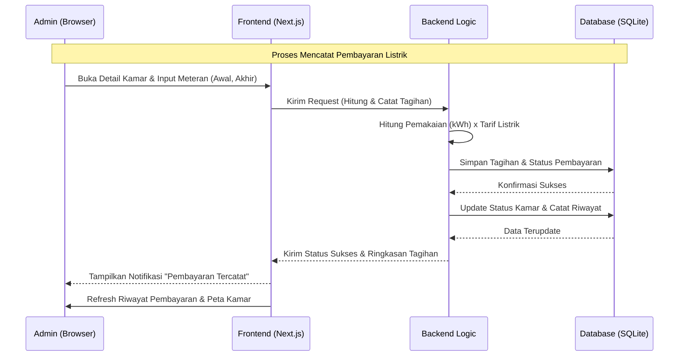
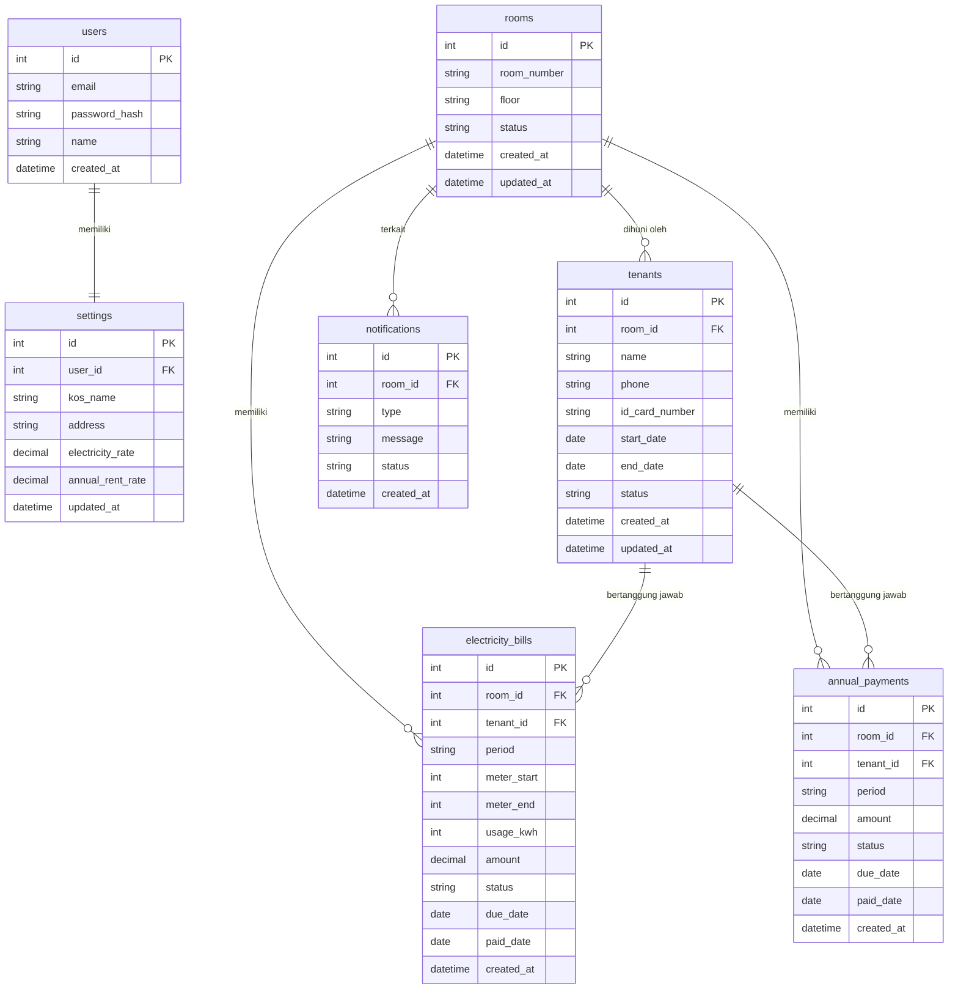

# PRD — Project Requirements Document

**Nama Aplikasi:** Pantau Kosan

## 1. Overview
Aplikasi ini bertujuan untuk mendigitalkan pengelolaan operasional kos-kosan yang sebelumnya umumnya dilakukan secara manual (buku catatan atau spreadsheet terpisah). Masalah utama yang ingin diselesaikan adalah kesulitan memantau status hunian kamar secara real-time, mengelola data penghuni, serta melacak dua jenis kewajiban pembayaran yang berbeda ritmenya: **tagihan listrik bulanan** (berbasis pemakaian meteran) dan **sewa kamar tahunan**.

Tujuan utama aplikasi adalah menyediakan platform berbasis web yang sederhana bagi **Pemilik Kos (Admin)** untuk memantau okupansi kamar melalui peta visual, mengelola penghuni, mencatat serta menagih pembayaran listrik dan sewa tahunan, mendapatkan pengingat tagihan otomatis, dan melihat ringkasan pemasukan serta tunggakan langsung di laporan.

## 2. Requirements
Berikut adalah persyaratan tingkat tinggi untuk pengembangan sistem:
- **Aksesibilitas:** Aplikasi harus dapat diakses melalui Web Browser (desktop/laptop diutamakan untuk input data dan pemantauan peta kamar).
- **Pengguna:** Sistem dirancang untuk satu Pemilik Kos sebagai Admin dengan akses penuh. Setiap akun mengelola satu profil kos.
- **Autentikasi:** Akses ke sistem dilindungi login. Tersedia pendaftaran akun dan pemulihan kata sandi (reset password).
- **Data Input:** Input data dilakukan secara manual (diketik), termasuk angka meteran listrik awal dan akhir.
- **Spesifisitas Data:** Setiap kamar memiliki status hunian (kosong/terisi/perbaikan). Setiap tagihan listrik mencatat periode, angka meteran, dan pemakaian (kWh). Setiap pembayaran sewa mencatat periode tahunan.
- **Notifikasi:** Peringatan tagihan (listrik jatuh tempo & sewa tahunan mendekati habis) ditampilkan sebagai pengingat di dalam aplikasi beserta riwayatnya.
- **Konfigurasi:** Tarif listrik (per kWh) dan tarif sewa tahunan dapat diatur oleh Admin melalui halaman Pengaturan.

## 3. Core Features
Fitur-fitur kunci dikelompokkan berdasarkan fase pengembangan (roadmap) sesuai prioritas perencanaan:

1.  **Peta Kamar** *(Fase 1)*
    - **Lihat Peta Kamar:** Tampilan visual seluruh kamar kos dalam satu layar.
    - **Lihat Detail Kamar:** Menampilkan informasi kamar (nomor, penghuni aktif, status tagihan).
    - **Sorot Status:** Penanda visual berdasarkan status kamar (kosong, terisi, perbaikan) atau status pembayaran.
2.  **Data Penghuni (Master Data)** *(Fase 2)*
    - **Lihat Daftar Penghuni:** Tabel seluruh penghuni beserta kamar yang ditempati.
    - **Tambah atau Ubah Penghuni:** Form untuk mendaftarkan penghuni baru atau memperbarui datanya.
    - **Hapus Penghuni:** Menghapus/menonaktifkan data penghuni yang sudah keluar.
3.  **Riwayat Pembayaran Listrik** *(Fase 2)*
    - **Lihat Tagihan Listrik:** Daftar tagihan listrik per kamar dan periode.
    - **Catat Pembayaran Listrik:** Input angka meteran (awal & akhir), sistem menghitung pemakaian × tarif.
    - **Lihat Riwayat Pembayaran:** Histori pembayaran listrik per kamar.
4.  **Riwayat Pembayaran Tahunan** *(Fase 2)*
    - **Lihat Tagihan Tahunan:** Daftar kewajiban sewa tahunan per kamar.
    - **Catat Pembayaran Tahunan:** Mencatat pembayaran sewa untuk periode satu tahun.
    - **Lihat Riwayat Tahunan:** Histori pembayaran sewa tahunan.
5.  **Notifikasi Tagihan** *(Fase 3)*
    - **Pengingat Listrik:** Peringatan tagihan listrik yang jatuh tempo/belum dibayar.
    - **Pengingat Sewa Tahunan:** Peringatan masa sewa yang akan berakhir.
    - **Riwayat Notifikasi:** Daftar seluruh notifikasi yang pernah dikirim.
6.  **Laporan Bulanan** *(Fase 3)*
    - **Ringkasan Pemasukan:** Total pemasukan (listrik + sewa) dalam satu periode.
    - **Daftar Tunggakan:** Daftar kamar/penghuni dengan pembayaran belum lunas.
    - **Ekspor Laporan:** Mengunduh laporan (misalnya CSV/PDF) untuk arsip.
7.  **Autentikasi** *(Fase 4)*
    - **Daftar Akun:** Registrasi akun pemilik kos baru.
    - **Login dan Logout:** Masuk dan keluar sistem secara aman.
    - **Atur Ulang Kata Sandi:** Pemulihan kata sandi bila lupa.
8.  **Pengaturan** *(Fase 4)*
    - **Profil Kos:** Data identitas kos (nama, alamat).
    - **Tarif Listrik:** Konfigurasi harga per kWh.
    - **Tarif Sewa Tahunan:** Konfigurasi harga sewa per kamar per tahun.

## 4. User Flow
Alur kerja sederhana bagi Admin (Pemilik Kos) saat menggunakan aplikasi:

1.  **Login:** Admin masuk menggunakan email dan password.
2.  **Setup Awal (sekali di awal):** Admin mengatur Profil Kos, Tarif Listrik, dan Tarif Sewa Tahunan di menu Pengaturan.
3.  **Monitoring:** Admin membuka **Peta Kamar** untuk melihat status hunian dan menyorot kamar yang perlu perhatian (kosong atau menunggak).
4.  **Kelola Penghuni:** Saat ada penghuni baru, Admin menambahkan data penghuni dan menautkannya ke kamar yang kosong.
5.  **Catat Pembayaran:**
    - **Listrik:** Admin membuka kamar terkait, memasukkan angka meteran awal & akhir. Sistem menghitung tagihan otomatis, lalu Admin menandai lunas.
    - **Sewa Tahunan:** Admin membuka tagihan tahunan kamar, lalu mencatat pembayaran sewa untuk periode berjalan.
6.  **Peringatan:** Sistem menampilkan **Notifikasi Tagihan** untuk listrik yang jatuh tempo dan sewa yang akan berakhir.
7.  **Verifikasi & Laporan:** Sistem otomatis memperbarui status pembayaran, mencatat riwayat, dan menyusun **Laporan Bulanan** (pemasukan & tunggakan) yang dapat diekspor.

## 5. Architecture
Berikut adalah gambaran arsitektur sistem dan aliran data secara teknis namun sederhana, menggunakan contoh proses pencatatan pembayaran listrik:

## 6. Database Schema

Berikut adalah Entity Relationship Diagram (ERD) yang menggambarkan struktur database utama:

| Tabel | Deskripsi |
|-------|-----------|
| **users** | Data akun Pemilik Kos (Admin) yang memiliki akses ke sistem |
| **settings** | Konfigurasi per akun: profil kos, tarif listrik per kWh, dan tarif sewa tahunan |
| **rooms** | Master data kamar kos beserta status hunian (kosong/terisi/perbaikan) |
| **tenants** | Data penghuni, tanggal masuk/keluar, dan kamar yang ditempati |
| **electricity_bills** | Tagihan listrik bulanan per kamar: periode, angka meteran, pemakaian, nominal, dan status bayar |
| **annual_payments** | Pencatatan pembayaran sewa tahunan per kamar beserta status dan periode |
| **notifications** | Log pengingat tagihan (listrik jatuh tempo & sewa akan berakhir) beserta statusnya |

## 7. Design & Technical Constraints
Bagian ini mengatur batasan teknis dan panduan desain yang harus dipatuhi tanpa mendikte pemilihan library secara spesifik.

1.  **High-Level Technology:**
    Sistem harus dibangun menggunakan teknologi modern yang mendukung pengembangan cepat (rapid development) dan kemudahan pemeliharaan (maintainability). Pengembang dibebaskan memilih tools yang tepat selama tidak terikat pada stack spesifik secara kaku, namun tetap memprioritaskan performa dan skalabilitas untuk penggunaan skala kecil hingga menengah (satu kos dengan puluhan kamar).

2.  **Typography Rules:**
    Sistem antarmuka (UI) wajib menggunakan konfigurasi font variable sebagai berikut untuk menjaga konsistensi visual:
    -   **Sans:** `Geist Mono, ui-monospace, monospace`
    -   **Serif:** `serif`
    -   **Mono:** `JetBrains Mono, monospace`
